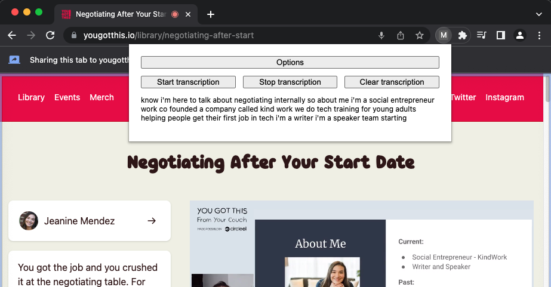

# Live Transcription Chrome Extension

Two Chrome browser extensions - one which transcribes any audio playing in a tab, and the other which additionally transcribes from the user's microphone.

## Setup

1. Download this repo as a zip file and unzip the contents.
2. Open [chrome://extensions/](chrome://extensions/) from your address bar and turn on developer mode.
3. Click "Load unpacked", and select either the tab-only or mic-and-tab directory.

## Usage

1. Open the extension from your tab bar, and enter a [Deepgram API Key](https://console.deepgram.com/signup?jump=keys).
2. On the tab you want to transcribe audio from, open the extension, click "Start transcription" and select the tab - you must also share tab audio for this extension to work.
3. At any time while transcribing, you can open the extension to see the full transcript.

## Code Explainer

### `manifest.json`

The manifest file is required for Chrome extensions. The provided `permissions` allow for storage (of transcripts and your API Key), access to tab data, and the ability to execute our transcription script. The `host_permissions` allow for this extension to run on any URL - you can change it if you want to limit it's usage to only specific websites.

### `popup.html` and `popup.js`

The popup is the visual pane that opens when the extension icon is clicked. On load, it fetches the latest transcript from storage, if there is one.

When the start button is clicked, the popup gets the current tab, and executes `content-script.js`.

When the stop button is clicked, a message is sent to `content-script.js` with the message 'stop'.

When the clear button is clicked, the currently-stored `transcript` value is removed.

When the options button is clicked, the extension's `options.html` file is opened.

When the popup receives a message with the value 'transcriptavailable', it gets the latest complete transcript from storage and adds it to the popup.

### `options.html` and `options.js`

The options pane gets and displays the existing Deepgram API key from storage, if it exists. It can also be used to save a new key.

### `content-script.js`

This script is executed when the user clicks the start button in the popup.

The script retrieves the Deepgram API Key from storage (set in the options pane), and asks the user to select a tab to share. If audio is not shared as part of this, the script will not continue.

In the **Mic & Tab** variant, the user is also asked for access to their mic, and the two audio sources are mixed into a single audio source ahead of transcription.

The transcription then takes place every 250ms using Deepgram's Speech Recognition API, and as transcripts are returned, they are saved into storage, and a `transcriptavailable` message is sent to the popup, prompting it to update the displayed value.

When the stop message is sent from the popup, the transcription session is closed.
